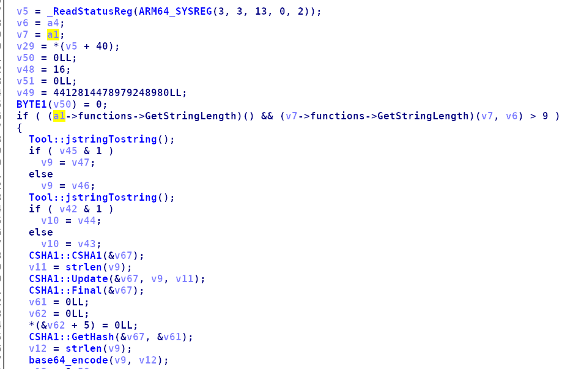

# Crackme1
`工具：apktools、dex2jar、ida、jdGui`

拿到apk文件首先使用apktools解包，再使用dex2jar提取apk或者dex文件的jar包。


在jdGui里看到的jar源码的逻辑大概是获取用户输入的用户名和密码，然后将密码送到native的`doSomeThing`方法中处理。好、可以确定主要的处理逻辑应该在链接库里。
用ida打开apk解包后的lib里的链接库文件。


未匹配到我们在jdGui里看到的native方法。只能采用迂回的方式寻找`doSomeThing`方法，首先在java调用jni方法时有传进去两个`String`，在c语言中并不能直接使用java的`String`对象，需要进行转换，而一般的转换函数应该是叫`jstringTostring`。尝试在方法中搜索`jstringTostring`，并查看交叉引用，从而匹配到我们要找到的方法。在方法名上按x可以查看该方法的交叉引用。


基本可以确定函数z应该就是java代码里的`doSomeThing`方法了。


进入分析，可以发现初始的伪代码并不太好看，主要是ida并没有处理好JNIEnv结构体，我们可以自己导入，并帮助ida识别，首先native函数的前两个传入参数一般是`JNIEnv`和`jobject`的指针类型，你可以先尝试修改参数一的类型为`_JNIEnv*`、参数二的类型为`_jobject*`，在变量名上按y可以修改变量类型，如果弹出错误，无法修改的话，就要手动导入，JNIEnv的结构体。
导入方法：菜单栏`View->openview->Type libraries`，快捷键`shift+f11`打开类型库。


按insert添加android，接着打开Structures窗口，按insert，点击add standard structure打开结构体添加窗口，选中`_JNIEnv`点击ok添加结构体。添加成功后就可以回去更改参数变量类型。


下图是更改后的ida重新反编译的伪C代码，相对之前，好看了很多。



根据伪c代码，可以知道大概的逻辑是先判断用户名和密码长度，再将用户名密码转换为cString，然后将用户名sha1加密并获取加密后sha1的Hash。


然后将sha1的hash值的每个字符再分成单双组提取他们的hex值。


然后是用双的那组反向与单的那组进行且运算得到结果再进行base64加密得到密码。


基本逻辑就是这样子，再根据理解写出exp。

```python
#/usr/bin/python
from hashlib import *
from base64 import *
username = ''
sha1Hash = sha1(username.encode('utf-8')).hexdigest()
l = len(sha1Hash)
single = ''
double = ''
i = 0
while i < l:
    single += hex(ord(sha1Hash[i]))[2:]
    i += 1
    double += hex(ord(sha1Hash[i]))[2:]
    i += 1
res = ''
for i in range(l):
    res += hex(ord(single[i]) & ord(double[l - 1 - i]))[2:]
print(b64encode(bytes(res, encoding='utf-8')))
```
题目也提供了用户名，所以直接提交用用户名计算出来的结果密码就可以了。