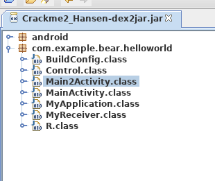
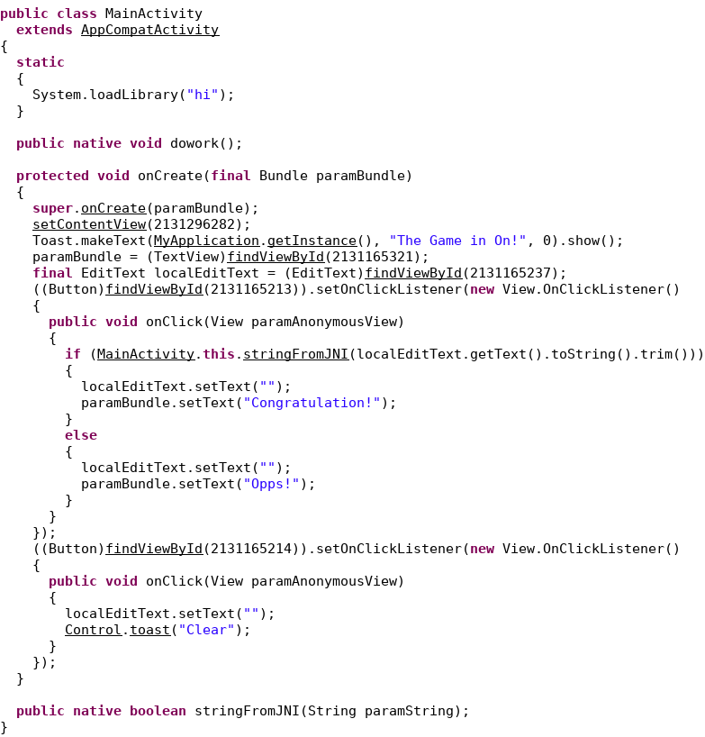

# Crackme2_Hansen
`工具：IDA、jdGui、apktools、dex2jar`

首先使用apktools解压apk文件、再用dex2jar提取jar包。
使用jdGui查看android的java源码，如图



首先发现该apk有两个`activity`，其中有一个`activity`是无论提交什么用户名密码都会返回`Name or Password Error!`。


而这个`activity`也是主的，安装apk后进去就只有这个`activity`，而另一个不会显示的`activity`是我们要破解的。



可以看到该`activity`是直接获取用户输入的`password`转交`native`方法`stringFromJNI`处理的。

用ida打开链接库并查找函数`stringFromJNI`，如果通过函数名找不到，可以先找到`jstringTostring`再通过交叉引用找到`stringFromJNI`。


主函数的逻辑是调用`callfunc`函数，传入了一个`JNIEnv*`和两个指针。


接着将处理后的指针`out`（图中)分成四组`0-7`、`8-15`、`16-23`和`24-31`。通过这个可以知道`out`通过`callfunc`处理后因该是一个`32 byte`的数据。
然后将`8-15`与`24-31`进行与运算的`hex`值接上`0-7`与`16-23`的异或运算的`hex`得到的结果就是密码。
好接下来就是分析`callfunc`怎么处理`out`得到`32`的数据的。


大概看了一下，发现该函数主要是调用dexclassloader动态加载的`Tool`，这样的话我们就要寻找动态加载的文件再分析了，但是我发现了这个函数里面的两个奇怪的地方。


这里莫名创建了`META-INF/MAN1FE5T.MF`这个`java`字符串;


这里是莫名的拿处理后的数据与`d41d8cd98f00b204e9800998ecf8427e`比较。
我查看了解包的`META-INF`目录，发现了试图融入正常文件的多出来的文件`MAN1FE5T.MF`，`cat`一下，内容是`Hansen`。


看了一下类似md5加密的`d41d8cd98f00b204e9800998ecf8427e`，果断拿`Hansen`去md5加密得到的`32 byte`hash值当作out，计算出密码。提交，正确。
这是exp

```python
#!/usr/bin/python
from hashlib import *

username = 'Hansen'
a = md5(username.encode('utf-8')).hexdigest()
#a = '630a16c4dbe8f48822a279b4a554916f' #Hansen的md5值
v26 = a[24:]
v30 = a[8:16]
v28 = a[16:24]
v32 = a[0:8]
res = ''
res1 = ''
for i in range(8):
 tmp = hex(ord(v26[i])&ord(v30[i]))[2:]
 tmp1 =hex(ord(v28[i])^ord(v32[i]))[2:] 
 if len(tmp) == 1:
  tmp = '0' + tmp
 if len(tmp1) == 1:
  tmp1 = '0' + tmp1
 res += tmp
 res1 += tmp1

res += res1
print(res)
```